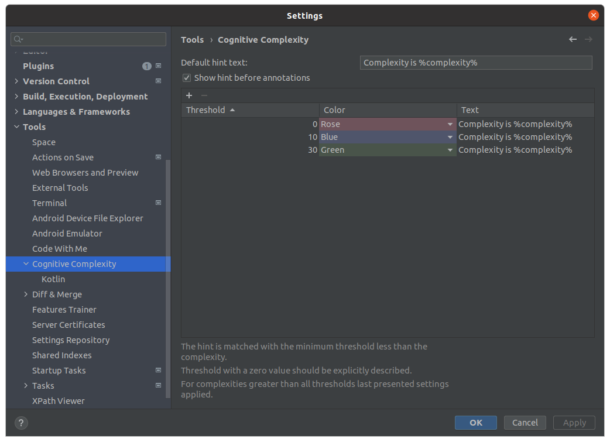
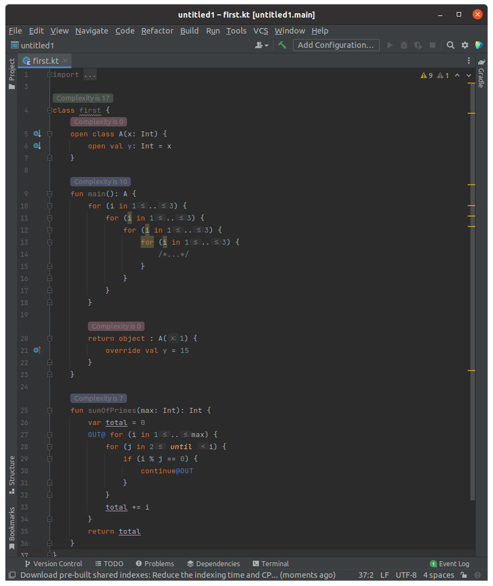
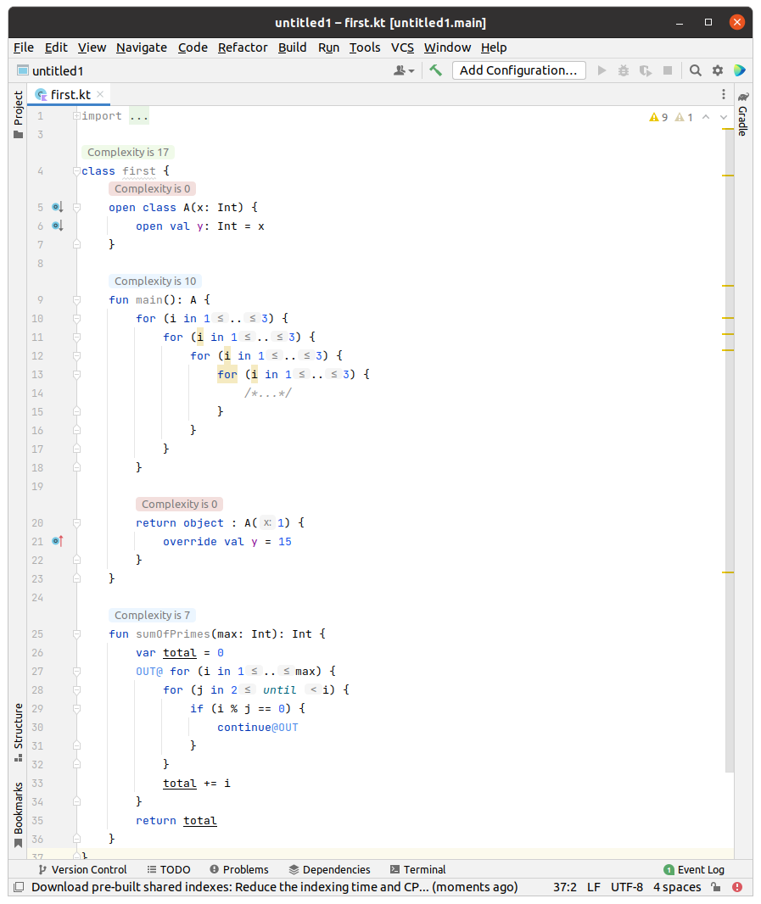

# Cognitive Complexity for IDEA

<!-- Plugin description -->
This plugin implements live calculation of the **Cognitive Complexity** metric, 
which was proposed by G. Ann Campbell in 
[Cognitive Complexity - A new way of measuring understandability](https://www.sonarsource.com/docs/CognitiveComplexity.pdf) 
(c) SonarSource S.A. 2016-2021, Switzerland.
<!-- Plugin description end -->

## Features
- Configurable hint threshold value and color
  
- Kotlin support
  
  

## Installation

- Using IDE built-in plugin system:
  
  <kbd>Settings/Preferences</kbd> > <kbd>Plugins</kbd> > <kbd>Marketplace</kbd> > <kbd>Search for "Cognitive Complexity for IDEA"</kbd> >
  <kbd>Install Plugin</kbd>
  
- Manually:

  Download the [latest release](https://github.com/berezhkoE/cognitive-complexity-plugin/releases/latest) and install it manually using
  <kbd>Settings/Preferences</kbd> > <kbd>Plugins</kbd> > <kbd>⚙️</kbd> > <kbd>Install plugin from disk...</kbd>

---
Plugin based on the [IntelliJ Platform Plugin Template][template].

[template]: https://github.com/JetBrains/intellij-platform-plugin-template
